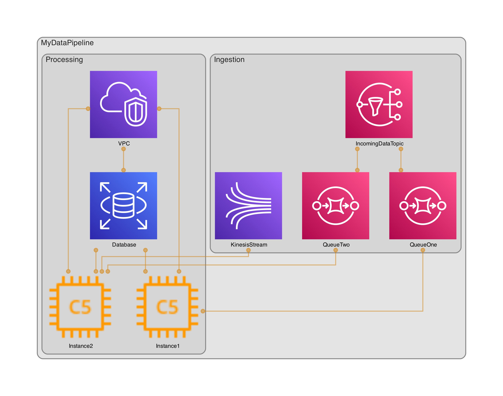
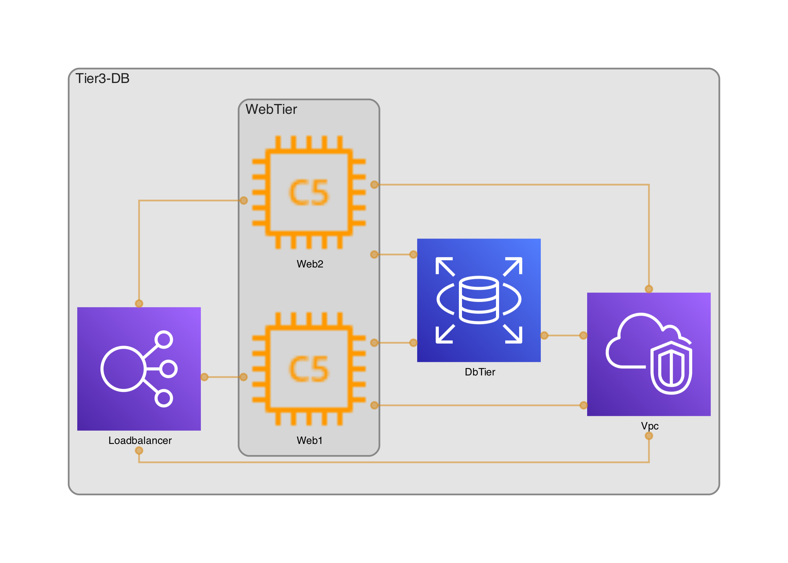
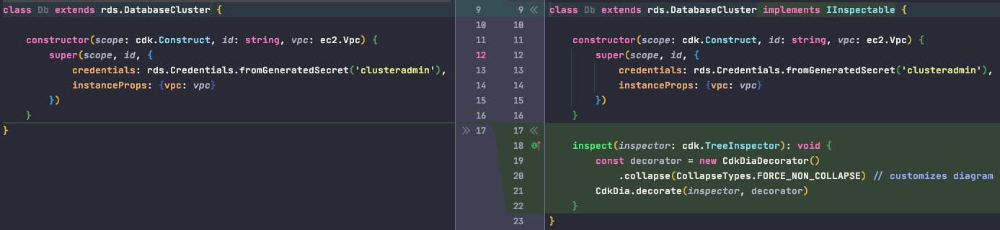
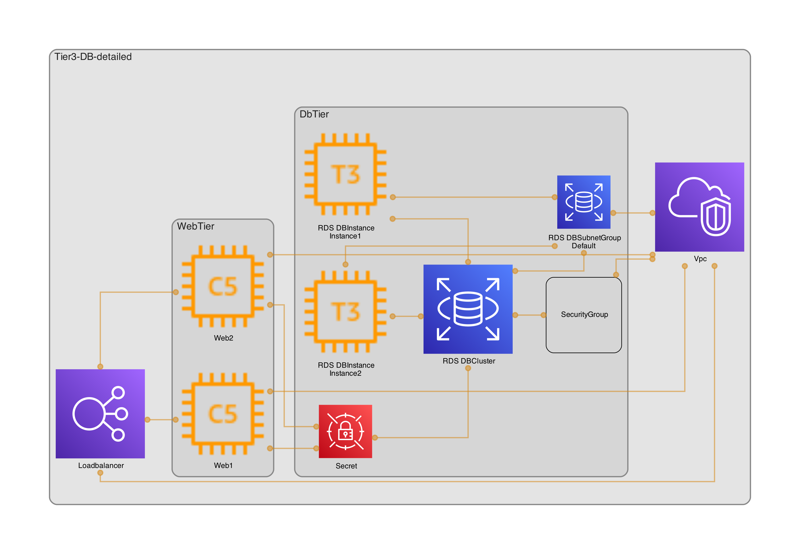

[](https://github.com/kolomied/awesome-cdk)

[](https://badge.fury.io/js/cdk-dia)

# 🎡 CDK-Dia - Automated diagrams for CDK infrastructure

_Cdk-dia diagrams your CDK provisioned infrastructure using the Grpahviz dot lanuguage._

## Example

This Diagram was automatically generated from an AWS CDK stack
<p align="center">
    
</p>

## Getting started
Add cdk-dia to your CDK project
```sh
$ npm install cdk-dia
```

Install Graphviz
```sh
$ brew install graphviz
```
* If you don't use brew: Graphviz installation in many environments is [well documented](https://graphviz.org/download/).
* make sure Graphviz's dot binary is available in your PATH.
  
Synthesize your CDK application
```sh
$ cdk synth
```

Generate a CDK-DIA diagram
```sh
$ npx cdk-dia
```
<br/>

## Customize diagrams

In some cases it is useful to be able to tweak a diagram. For this purpose CDK-DIA includes customizers/decorators
you can use with your CDK constructs in order to tweak the diagram.

* In order to customize you have to add cdk-dia as a npm project dependency (globally installing it using `npm -g` won't allow you to use the `CdkDiaDecorator` class)

### Example:
Consider the following diagram of a 3-Tier CDK Stack:


In this diagram CDK-DIA collapsed the DBTier (done automatically to any CDK Level 2 (L2) construct) in order to
create a diagram which contains the most important details.

One can use a decorator in order to customize the diagram and prevent CDK-DIA from collapsing the Construct.

This is done by implementing CDK's IInpectable's interface and using CDK-DIA's decorator. example:



This results in a Diagram where the DB-Tier was not collapsed providing more details:


* a full example or the above can be found at [examples/decoration-example](examples/decoration-example)

## CLI arguments
* ```npx cdk-dia --help``` - Get possible arguments
* ```npx cdk-dia --stacks stackOne stackFour``` - only diagram chosen aws-cdk stacks
    * ```npx cdk-dia --stacks pipelinestack/prod/database``` - choose stacks by path (nested stacks, pipeline stacks)
